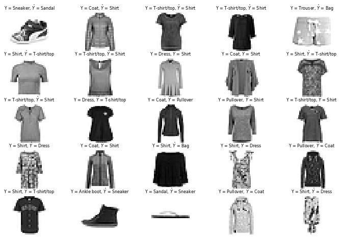

# Fashion-MNIST Classification using Convolutional Neural Networks (CNN) in Python

## 1. Objective

The objective of this section is to develop a Convolutional Neural Network (CNN) to classify the clothing-articles using the widely used Fashion-MNIST dataset.

## 2. Motivation

The MNIST handwritten digit classification problem is a standard dataset used in computer vision and deep learning.

Since the MINIST dataset is effectively solved,  the Fashion-MNIST has recently been collected and labelled to serve as a direct drop-in replacement for the original MNIST dataset for benchmarking machine and deep learning algorithms. The Fashion-MNIST dataset shares the same image size and structure of training and testing splits.as the original MNIST dataset

In this section, we shall demonstrate how to develop convolutional neural network for clothing items classification from scratch, using the Fashion-MNIST dataset, including:

* How to prepare the input training and test data 
* How to deploy the model
* How to use the trained model to make predictions
* How to evaluate its performance

## 3. Data

The Fashion-MNIST is a dataset of clothing articles images:
* It contains training set of 60,000 examples
* It contains a test set of 10,000 examples.
  * Each example is a 28x28 grayscale image
  * Each example is associated with a label from 10 classes.
* Recently, the Fashion-MNIST is starting to serve as a direct drop-in replacement for the original MNIST dataset for benchmarking machine and deep learning algorithms.
  * It shares the same image size and structure of training and testing splits.
  * Additional detailed about the Fashion can be in [1]

Sample images from the MNIST data set are illustrated next:
  * There are significant variations between the different types of clothing articles
  * There are significant variations between different examples of the same clothing article class.
  

## 4. Development

In this section, we shall demonstrate how to develop a Convolutional Neural Network (CNN) for clothing-articles classification from scratch, including:

* How to prepare the input training and test data 
* How to deploy the model
* How to use the trained model to make predictions
* How to evaluate its performance

* Author: Mohsen Ghazel (mghazel)
* Date: April 6th, 2021

* Project: FASHION-MNIST clothing articles Classification using Convolutional Neural Networks (CNN):

The objective of this project is to demonstrate how to develop a Convolutional Neural Network (CNN) to classify images of clothing articles from the Fashion-MNIST dataset:

* Fashion-MNIST is a dataset of Zalando's article images
 * It contains training set of 60,000 examples
 * It contains a test set of 10,000 examples.
  * Each example is a 28x28 grayscale image
  * Each example is associated with a label from 10 classes.
 * Recently, the Fashion-MNIST is starting to serve as a direct drop-in replacement for the original MNIST dataset for benchmarking machine and deep learning algorithms.
   * It shares the same image size and structure of training and testing splits.
   * Additional detailed about the Fashion can be found here:
     * https://github.com/zalandoresearch/fashion-mnist

We shall apply the standard Machine and Deep Learning model development and evaluation process, with the following steps:

1. Load the MNIST dataset of handwritten digits:
 * 60,000 labelled training examples
 * 10,000 labelled test examples
  * Each handwritten example is 28x28 pixels binary image.

2. Build a simple CNN model
3. Train the selected ML model
4. Deploy the trained on the test data
5. Evaluate the performance of the trained model using evaluation metrics:
   * Accuracy
   * Confusion Matrix
   * Other metrics derived form the confusion matrix.

### 4.1. Part 1: Imports and global variables:

#### 4.1.1 Standard scientific Python imports:

<pre style="color:#000000;background:#e6ffff;font-size:10px;line-height:1.5;"># Numpy
import numpy as np
# matplotlib
import matplotlib.pyplot as plt
# - import sklearn to use the confusion matrix function
from sklearn.metrics import confusion_matrix
# import itertools
import itertools
# opencv
import cv2
# tensorflow
import tensorflow as tf

# keras input layer
from tensorflow.keras.layers import Input
# keras conv2D layer
from tensorflow.keras.layers import Conv2D
# keras MaxPooling2D layer
from tensorflow.keras.layers import MaxPooling2D
# keras Dense layer
from tensorflow.keras.layers import Dense
# keras Flatten layer
from tensorflow.keras.layers import Flatten
# keras Dropout layer
from tensorflow.keras.layers import Dropout
# keras model
from tensorflow.keras.models import Model
# keras sequential model
from tensorflow.keras.models import Sequential
# optimizers
from tensorflow.keras.optimizers import SGD

# random number generators values
# seed for reproducing the random number generation
from random import seed
# random integers: I(0,M)
from random import randint
# random standard unform: U(0,1)
from random import random
# time
import datetime
# I/O
import os
# sys
import sys

# check for successful package imports and versions
# python
print("Python version : {0} ".format(sys.version))
# OpenCV
print("OpenCV version : {0} ".format(cv2.__version__))
# numpy
print("Numpy version  : {0}".format(np.__version__))
# tensorflow
print("Tensorflow version  : {0}".format(tf.__version__))

Python version : 3.7.10 (default, Feb 20 2021, 21:17:23) 
[GCC 7.5.0] 
OpenCV version : 4.1.2 
Numpy version  : 1.19.5
Tensorflow version  : 2.4.1
</pre>

#### 4.1.2. Global variables:
  
  
<pre style="color:#000000;background:#e6ffff;font-size:10px;line-height:1.5;"># -set the random_state seed = 100 for reproducibilty
random_state_seed = 100

# the number of visualized images
num_visualized_images = 25
</pre>

### 4.2. Part 2: Load FASHION-MNIST Dataset

#### 4.2.1. Load the FASHION-MNIST dataset :
* Load the MNIST dataset of handwritten digits:
  * 60,000 labelled training examples
  * 10,000 labelled test examples
    * Each handwritten example is 28x28 pixels binary image.

<pre style="color:#000000;background:#e6ffff;font-size:10px;line-height:1.5;"># Load in the FASHION-MNIST data set
# - It has 10 classes
fashion_mnist = tf.keras.datasets.fashion_mnist
# split the data into teaining and test subsets
(x_train, y_train), (x_test, y_test) = fashion_mnist.load_data()
</pre>

#### 4.2.2. Explore training and test images:

##### 4.2.2.1. Display the number and shape of the training and test subsets:
  

<pre style="color:#000000;background:#e6ffff;font-size:10px;line-height:1.5;">#------------------------------------------------------
# Training data:
#------------------------------------------------------
# the number of training images
num_train_images = x_train.shape[0]
print("----------------------------------------------")
print("Training data:")
print("----------------------------------------------")
print("x_train.shape: ", x_train.shape)
print("Number of training images: ", num_train_images)
print("Image size: ", x_train.shape[1:])

#------------------------------------------------------
# Test data:
#------------------------------------------------------
# the number of test images
num_test_images = x_test.shape[0]
print("----------------------------------------------")
print("Test data:")
print("----------------------------------------------")
print("x_test.shape: ", x_test.shape)
print("Number of test images: ", num_test_images)
print("Image size: ", x_test.shape[1:])
print("----------------------------------------------")

----------------------------------------------
Training data:
----------------------------------------------
x_train.shape:  (60000, 28, 28)
Number of training images:  60000
Image size:  (28, 28)
----------------------------------------------
Test data:
----------------------------------------------
x_test.shape:  (10000, 28, 28)
Number of test images:  10000
Image size:  (28, 28)
----------------------------------------------
</pre>

#### 4.2.2. Reshape the training and test images to 3D:

The training and test images are 2D grayscale/binary:
 * CNN expect the images to be of shape:
   * height x width x color
 * We need to add a fourth color dimension to:
   * The training images: x_train
   * The test images: x_test
   

<pre style="color:#000000;background:#e6ffff;font-size:10px;line-height:1.5;">#------------------------------------------------------
# reshape the x_train and x_test images 4D:
#------------------------------------------------------
# Add a fourth color dimension to x_train
x_train = np.expand_dims(x_train, -1) 
# add a fourth color dimension to x_test
x_test = np.expand_dims(x_test, -1)
#------------------------------------------------------
# display the new shapes of x_train and x_test
#------------------------------------------------------
print("----------------------------------------------")
print("Re-shaped x_train:")
print("----------------------------------------------")
print("x_train.shape: ", x_train.shape)
print("----------------------------------------------")
print("Re-shaped x_test:")
print("----------------------------------------------")
print("x_test.shape: ", x_test.shape)
print("----------------------------------------------")

----------------------------------------------
Re-shaped x_train:
----------------------------------------------
x_train.shape:  (60000, 28, 28, 1, 1)
----------------------------------------------
Re-shaped x_test:
----------------------------------------------
x_test.shape:  (10000, 28, 28, 1, 1)
----------------------------------------------
</pre>

#### 4.2.3. Display the targets/classes:

* There 10 classes:
   * Each training and test example is assigned to one of the following labels:
   

   
##### 4.2.3.1. Display the number of classes:

<pre style="color:#000000;background:#e6ffff;font-size:10px;line-height:1.5;"># The number of classes
num_classes = len(set(y_train))
print("The number of classes:", num_classes)

The number of classes: 10

</pre>

##### 4.2.3.2. Create meaningful labels for the different classes:

<pre style="color:#000000;background:#e6ffff;font-size:10px;line-height:1.5;">#-------------------------------------------------------------------------------
# Create a class-label mapping:
#-------------------------------------------------------------------------------
#  - Create a string containg all the classification labels 
#  - Seperated by new line character
#-------------------------------------------------------------------------------
labels = '''T-shirt/top
Trouser
Pullover
Dress
Coat
Sandal
Shirt
Sneaker
Bag
Ankle boot'''.split("\n")

</pre>

#### 4.2.3.3. Display the created class-label mapping:

<pre style="color:#000000;background:#e6ffff;font-size:10px;line-height:1.5;"># display the classes
for counter in range(num_classes):
  print('Class ID = {}, Class name = {}'.format(counter, labels[counter]))

Class ID = 0, Class name = T-shirt/top
Class ID = 1, Class name = Trouser
Class ID = 2, Class name = Pullover
Class ID = 3, Class name = Dress
Class ID = 4, Class name = Coat
Class ID = 5, Class name = Sandal
Class ID = 6, Class name = Shirt
Class ID = 7, Class name = Sneaker
Class ID = 8, Class name = Bag
Class ID = 9, Class name = Ankle boot
</pre>

#### 4.2.4. Examine the number of images for each class of the training and testing subsets:

<pre style="color:#000000;background:#e6ffff;font-size:10px;line-height:1.5;"># Create a histogram of the number of images in each class/digit:
def plot_bar(y, loc='left', relative=True):
    width = 0.35
    if loc == 'left':
        n = -0.5
    elif loc == 'right':
        n = 0.5
     
    # calculate counts per type and sort, to ensure their order
    unique, counts = np.unique(y, return_counts=True)
    sorted_index = np.argsort(unique)
    unique = unique[sorted_index]
     
    if relative:
        # plot as a percentage
        counts = 100*counts[sorted_index]/len(y)
        ylabel_text = '% count'
    else:
        # plot counts
        counts = counts[sorted_index]
        ylabel_text = 'count'
         
    xtemp = np.arange(len(unique))
    plt.bar(xtemp + n*width, counts, align='center', alpha=.7, width=width)
    plt.xticks(xtemp, unique, rotation=45)
    plt.xlabel('digit')
    plt.ylabel(ylabel_text)
 
plt.suptitle('Frequency of images per digit')
plot_bar(y_train, loc='left')
plot_bar(y_test, loc='right')
plt.legend([
    'train ({0} images)'.format(len(y_train)), 
    'test ({0} images)'.format(len(y_test)), 
]);
</pre>

 
 
 #### 42.2.5. Visualize some of the training and test images and their associated targets:

* First implement a visualization functionality to visualize the number of randomly selected images:

<pre style="color:#000000;background:#e6ffff;font-size:10px;line-height:1.5;">"""
# A utility function to visualize multiple images:
"""
def visualize_images_and_labels(num_visualized_images = 25, dataset_flag = 1):
  """To visualize images.

&nbsp;&nbsp;&nbsp;&nbsp;&nbsp;&nbsp;Keyword arguments:
&nbsp;&nbsp;&nbsp;&nbsp;&nbsp;&nbsp;&nbsp;&nbsp;&nbsp;- num_visualized_images -- the number of visualized images (deafult 25)
&nbsp;&nbsp;&nbsp;&nbsp;&nbsp;&nbsp;&nbsp;&nbsp;&nbsp;- dataset_flag -- 1: training dataset, 2: test dataset
&nbsp;&nbsp;&nbsp;&nbsp;&nbsp;&nbsp;Return:
&nbsp;&nbsp;&nbsp;&nbsp;&nbsp;&nbsp;&nbsp;&nbsp;&nbsp;- None
&nbsp;&nbsp;"""
  #--------------------------------------------
  # the suplot grid shape:
  #--------------------------------------------
  num_rows = 5
  # the number of columns
  num_cols = num_visualized_images // num_rows
  # setup the subplots axes
  fig, axes = plt.subplots(nrows=num_rows, ncols=num_cols, figsize=(8, 10))
  # set a seed random number generator for reproducible results
  seed(random_state_seed)
  # iterate over the sub-plots
  for row in range(num_rows):
      for col in range(num_cols):
        # get the next figure axis
        ax = axes[row, col];
        # turn-off subplot axis
        ax.set_axis_off()
        #--------------------------------------------
        # if the dataset_flag = 1: Training data set
        #--------------------------------------------
        if ( dataset_flag == 1 ): 
          # generate a random image counter
          counter = randint(0,num_train_images)
          # get the training image
          image = np.squeeze(x_train[counter,:])
          # get the target associated with the image
          label = labels[y_train[counter]]
        #--------------------------------------------
        # dataset_flag = 2: Test data set
        #--------------------------------------------
        else: 
          # generate a random image counter
          counter = randint(0,num_test_images)
          # get the test image
          image = np.squeeze(x_test[counter,:])
          # get the target associated with the image
          label = labels[y_test[counter]]
        #--------------------------------------------
        # display the image
        #--------------------------------------------
        ax.imshow(image, cmap=plt.cm.gray_r, interpolation='nearest')
        # set the title showing the image label
        ax.set_title(str(label), size = 8)
</pre>

##### 4.2.5.1. Visualize some of the training images and their associated targets:

##### 4.2.5.2. Visualize some of the test images and their associated targets:

<pre style="color:#000000;background:#e6ffff;font-size:10px;line-height:1.5;"># call the function to visualize the training images
visualize_images_and_labels(num_visualized_images, 1)
</pre>

#### 4.2.6. Normalize the training and test images to the interval: [0, 1]:

<pre style="color:#000000;background:#e6ffff;font-size:10px;line-height:1.5;"># Normalize the training images
x_train = x_train / 255.0
# Normalize the test images
x_test = x_test / 255.0
</pre>

### 4.3. Part 3: Build the CNN model architecture

#### 4.3.1. Design the structure of the CNN model to classify the FASHION-MINIST images:

<pre style="color:#000000;background:#e6ffff;font-size:10px;line-height:1.5;">#-------------------------------------------------------------------------------
# Build the sequential CNN model
#-------------------------------------------------------------------------------
# Build the model using the functional API
#-------------------------------------------------------------------------------
# Layer # 1: Input layer
#-------------------------------------------------------------------------------
# - input images size: (28, 28, 10)
#-------------------------------------------------------------------------------
i = Input(shape=x_train[0].shape)            
#-------------------------------------------------------------------------------
# Layer # 2: Convolutional layer
#-------------------------------------------------------------------------------
# - 32 filters:  
#   - size: 3x3
#   - same
#   - stride = 2 (non-overlapping)
# - Activation function: relu
#-------------------------------------------------------------------------------               
x = Conv2D(32, (3, 3), strides=2, activation='relu')(i)     
#-------------------------------------------------------------------------------
# Layer # 3: Convolutional layer
#-------------------------------------------------------------------------------
# - 64 filters:  
#   - size: 3x3
#   - same
#   - stride = 2 (non-overlapping)
# - Activation function: relu
#------------------------------------------------------------------------------- 
x = Conv2D(64, (3, 3), strides=2, activation='relu')(x)     
#-------------------------------------------------------------------------------
# Layer # 4: Convolutional layer
#-------------------------------------------------------------------------------
# - 128 filters:  
#   - size: 3x3
#   - same
#   - stride = 2 (non-overlapping)
# - Activation function: relu
#------------------------------------------------------------------------------- 
x = Conv2D(128, (3, 3), strides=2, activation='relu')(x)    
#-------------------------------------------------------------------------------
# Layer # 5: Flatten
#-------------------------------------------------------------------------------
# - Flatten to connect to the next Fully-Connected Dense layer
#------------------------------------------------------------------------------- 
x = Flatten()(x)                                           
#-------------------------------------------------------------------------------
# Layer # 6: Dropout layer
#-------------------------------------------------------------------------------
# - p = 0.20  
#------------------------------------------------------------------------------- 
x = Dropout(0.2)(x)                                        
#-------------------------------------------------------------------------------
# Layer # 7: Dense layer
#-------------------------------------------------------------------------------
# - 512 neurons
# - Activation function: relu
#------------------------------------------------------------------------------- 
x = Dense(512, activation='relu')(x)                        
#-------------------------------------------------------------------------------
# Layer # 8: Dropout layer
#-------------------------------------------------------------------------------
# - p = 0.20  
#------------------------------------------------------------------------------- 
x = Dropout(0.2)(x)                                        
#-------------------------------------------------------------------------------
# Layer # 9: Output layer
#-------------------------------------------------------------------------------
# - Number of neurons: num_classes 
# - Activation function: softwmax:
#   - Suitable for multi-class classification.
#------------------------------------------------------------------------------- 
x = Dense(num_classes, activation='softmax')(x)           
#-------------------------------------------------------------------------------          
# Create the model with above structure:
#-------------------------------------------------------------------------------
model = Model(i, x)
</pre>

#### 4.3.2. Print the designed model summary:

<pre style="color:#000000;background:#e6ffff;font-size:10px;line-height:1.5;"># print the model summary
model.summary()
</pre>

<pre style="color:#000000;background:#e6ffff;font-size:10px;line-height:1.5;">Model: "model"
_________________________________________________________________
Layer (type)                 Output Shape              Param #   
=================================================================
input_2 (InputLayer)         [(None, 28, 28, 1)]       0         
_________________________________________________________________
conv2d_3 (Conv2D)            (None, 13, 13, 32)        320       
_________________________________________________________________
conv2d_4 (Conv2D)            (None, 6, 6, 64)          18496     
_________________________________________________________________
conv2d_5 (Conv2D)            (None, 2, 2, 128)         73856     
_________________________________________________________________
flatten_1 (Flatten)          (None, 512)               0         
_________________________________________________________________
dropout_2 (Dropout)          (None, 512)               0         
_________________________________________________________________
dense_1 (Dense)              (None, 512)               262656    
_________________________________________________________________
dropout_3 (Dropout)          (None, 512)               0         
_________________________________________________________________
dense_2 (Dense)              (None, 10)                5130      
=================================================================
Total params: 360,458
Trainable params: 360,458
Non-trainable params: 0
_________________________________________________________________
</pre>

### 4.4. Part 4: Compile the CNN model

* Compile the CNN model, developed above:

<pre style="color:#000000;background:#e6ffff;font-size:10px;line-height:1.5;">#-------------------------------------------------------------------------------
# Compile the model
#-------------------------------------------------------------------------------
# experiment with the optimizer
# opt = SGD(lr=0.01, momentum=0.9)
# compile the model
model.compile(optimizer='adam',                       # optimzer: adam
              loss='sparse_categorical_crossentropy', # used for multi-class models
              metrics=['accuracy'])                   # performance evaluation metric
</pre>

### 4.5. Part 5: Train/Fit the model:

* Start training the compiled CNN model:

<pre style="color:#000000;background:#e6ffff;font-size:10px;line-height:1.5;">#-------------------------------------------------------------------------------
# Train/fit the model:
#-------------------------------------------------------------------------------
r = model.fit(x_train, y_train, validation_data=(x_test, y_test), epochs=100)

Epoch 1/100
1875/1875 [===] - 30s 16ms/step - loss: 0.1246 - accuracy: 0.9526 - val_loss: 0.3747 - val_accuracy: 0.8960
Epoch 2/100
1875/1875 [===] - 30s 16ms/step - loss: 0.1190 - accuracy: 0.9555 - val_loss: 0.3917 - val_accuracy: 0.9009
Epoch 3/100
1875/1875 [===] - 28s 15ms/step - loss: 0.1147 - accuracy: 0.9563 - val_loss: 0.3773 - val_accuracy: 0.8982
Epoch 4/100
1875/1875 [===] - 29s 15ms/step - loss: 0.1069 - accuracy: 0.9591 - val_loss: 0.4193 - val_accuracy: 0.8992
Epoch 5/100
1875/1875 [===] - 28s 15ms/step - loss: 0.1042 - accuracy: 0.9596 - val_loss: 0.4038 - val_accuracy: 0.8966
...........................................................................................................
...........................................................................................................
Epoch 95/100
1875/1875 [===] - 28s 15ms/step - loss: 0.0509 - accuracy: 0.9840 - val_loss: 0.8433 - val_accuracy: 0.8945
Epoch 96/100
1875/1875 [===] - 28s 15ms/step - loss: 0.0467 - accuracy: 0.9857 - val_loss: 0.8165 - val_accuracy: 0.8963
Epoch 97/100
1875/1875 [===] - 28s 15ms/step - loss: 0.0509 - accuracy: 0.9842 - val_loss: 0.8469 - val_accuracy: 0.8994
Epoch 98/100
1875/1875 [===] - 28s 15ms/step - loss: 0.0519 - accuracy: 0.9847 - val_loss: 0.8615 - val_accuracy: 0.8966
Epoch 99/100
1875/1875 [===] - 28s 15ms/step - loss: 0.0545 - accuracy: 0.9837 - val_loss: 0.8267 - val_accuracy: 0.8981
Epoch 100/100
1875/1875 [===] - 28s 15ms/step - loss: 0.0485 - accuracy: 0.9853 - val_loss: 0.8747 - val_accuracy: 0.8993
</pre>

### 4.6. Part 6: Evaluate the model

* Evaluate the trained CNN model on the test data using different evaluation metrics:
  * Loss function
  * Accuracy
  * Confusion matrix.

### 4.6.1. Loss function:

* Display the variations of the training and validation loss function with the number of epochs:

<pre style="color:#000000;background:#e6ffff;font-size:10px;line-height:1.5;"># Plot loss per iteration
import matplotlib.pyplot as plt
plt.plot(result.history['loss'], label='loss')
plt.plot(result.history['val_loss'], label='val_loss');
plt.legend();
plt.xlabel('Epoch Iteration');
plt.ylabel('Loss');
</pre>

### 4.6.2. Accuracy:

* Display the variations of the training and validation accuracy with the number of epochs:

<pre style="color:#000000;background:#e6ffff;font-size:10px;line-height:1.5;"># Plot accuracy per iteration
plt.plot(result.history['accuracy'], label='acc');
plt.plot(result.history['val_accuracy'], label='val_acc');
plt.legend();
plt.xlabel('Epoch Iteration');
plt.ylabel('Accuracy');
</pre>

#### 4.6.3. Compute the test-data Accuracy:

* Compute and display the accuracy on the test-data:

<pre style="color:#000000;background:#e6ffff;font-size:10px;line-height:1.5;"># Compute the model accuracy on the test data
accuracy_test_data = model.evaluate(x_test, y_test)
# display the atest-data accuracy
print('-------------------------------------------------------')
print('The test-data accuracy = ' + str(accuracy_test_data[1]))
print('-------------------------------------------------------')

313/313 [==============================] - 1s 5ms/step - loss: 0.8747 - accuracy: 0.8993
-------------------------------------------------------
The test-data accuracy = 0.8992999792098999
-------------------------------------------------------
</pre>

#### 4.6.4. Confusion Matrix Visualizations:

* Compute the confusion matrix:

<pre style="color:#000000;background:#e6ffff;font-size:10px;line-height:1.5;">#-------------------------------------------------------------------------------
# Compute the confusion matrix
#-------------------------------------------------------------------------------
def plot_confusion_matrix(cm, classes,
                          normalize=False,
                          title='Confusion matrix',
                          cmap=plt.cm.Blues):
  """
&nbsp;&nbsp;This function prints and plots the confusion matrix.
&nbsp;&nbsp;Normalization can be applied by setting `normalize=True`.
&nbsp;&nbsp;"""
  if normalize:
      cm = cm.astype('float') / cm.sum(axis=1)[:, np.newaxis]
      print("Normalized confusion matrix")
  else:
      print('Confusion matrix, without normalization')

  # Display the confusuon matrix
  print(cm)
  # display the confusion matrix
  plt.imshow(cm, interpolation='nearest', cmap=cmap)
  plt.title(title)
  plt.colorbar()
  tick_marks = np.arange(len(classes))
  plt.xticks(tick_marks, classes, rotation=45)
  plt.yticks(tick_marks, classes)
  
  fmt = '.2f' if normalize else 'd'
  thresh = cm.max() / 2.
  for i, j in itertools.product(range(cm.shape[0]), range(cm.shape[1])):
      plt.text(j, i, format(cm[i, j], fmt),
               horizontalalignment="center",
               color="white" if cm[i, j] &gt; thresh else "black")

  plt.tight_layout()
  plt.ylabel('True label')
  plt.xlabel('Predicted label')
  plt.show()

#-------------------------------------------------------------------------------
# Predict the targets for the test data
#-------------------------------------------------------------------------------
p_test = model.predict(x_test).argmax(axis=1)
# construct the confusion matrix
cm = confusion_matrix(y_test, p_test)
# plot the confusion matrix
plot_confusion_matrix(cm, list(range(10)), 
                      False, 
                      'Confusion matrix', 
                      plt.cm.Greens)
</pre>

#### 4.6.5. Examine some of the misclassified digits:

* Display some of the misclassified items:

<pre style="color:#000000;background:#e6ffff;font-size:10px;line-height:1.5;"># - Find the indices of all the mis-classified examples
misclassified_idx = np.where(p_test != y_test)[0] # select the index
# setup the subplot grid for the visualized images
 # the suplot grid shape
num_rows = 5
# the number of columns
num_cols = num_visualized_images // num_rows
# setup the subplots axes
fig, axes = plt.subplots(nrows=num_rows, ncols=num_cols, figsize=(12, 8))
# set a seed random number generator for reproducible results
seed(random_state_seed)
# iterate over the sub-plots
for row in range(num_rows):
  for col in range(num_cols):
    # get the next figure axis
    ax = axes[row, col];
    # turn-off subplot axis
    ax.set_axis_off()
    # select a random mis-classified example
    counter = np.random.choice(misclassified_idx)
    # get test image 
    image = np.squeeze(x_test[counter,:])
    # get the true labels of the selected image
    label = labels[y_test[counter]]
    # get the predicted label of the test image
    yhat = labels[p_test[counter]]
    # display the image 
    ax.imshow(image, cmap=plt.cm.gray_r, interpolation='nearest')
    # display the true and predicted labels on the title of tehe image
    ax.set_title('Y = %s, $\hat{Y}$ = %s' % ((label), (yhat)), size = 8)
</pre>

### 4.7. Part 7: Display a final message after successful execution completion:

<pre style="color:#000000;background:#e6ffff;font-size:10px;line-height:1.5;"># display a final message
# current time
now = datetime.datetime.now()
# display a message
print('Program executed successfully on: '+ str(now.strftime("%Y-%m-%d %H:%M:%S") + "...Goodbye!\n"))

Program executed successfully on: 2021-04-05 19:42:07...Goodbye!
</pre>

## 5. Analysis

* In view of the presented results, we make the following observations:

 * The simple designed CNN achieves reasonably high accuracy (90%) of the FASHION-MNIST data classification.
 * The few misclassifications appear reasonable:
 * It is reasonable to confuse shirt with coat
 * It is reasonable to confuse shirt with dress
 * It is reasonable to confuse shirt with T-shirt/top.

## 6. Future Work

* We plan to explore the following related issues:

 * To explore ways of improving the performance of this simple CNN, including fine-tuning the following hyper-parameters:
   * The validation loss function is increasing while the training loss function is decreasing:
   * This indicates over-fitting
 * We shall address this over-fitting by adding dropout and batch normalization layers.
 * We shall also explore fine-tuning some of the hyper-parameters, including:
   * The number of filters and layers
   * The dropout rate
   * The optimizer
   * The learning rate.

## 7. References

1. Fashion-MNIST. Fashion-MNIST. Retrieved from: https://github.com/zalandoresearch/fashion-mnist. 
2. Jason Brownlee. Deep Learning CNN for Fashion-MNIST Clothing Classification. Retrieved from: https://machinelearningmastery.com/how-to-develop-a-cnn-from-scratch-for-fashion-mnist-clothing-classification/. 
3. Manish Bhob. Classifying Fashion with a Keras CNN (achieving 94% accuracy)  Part 1. Retrieved from: https://medium.com/@mjbhobe/classifying-fashion-with-a-keras-cnn-achieving-94-accuracy-part-1-1ffcb7e5f61a. 
4. Gabriel Preda. CNN with Tensorflow|Keras for Fashion MNIST. Retrieved from: https://www.kaggle.com/gpreda/cnn-with-tensorflow-keras-for-fashion-mnist. 
5. Adrian Rosebrock. Fashion MNIST with Keras and Deep Learning. Retrieved from: https://www.pyimagesearch.com/2019/02/11/fashion-mnist-with-keras-and-deep-learning/. 
6. Deepak Singh. Fashion-MNIST using Deep Learning with TensorFlow Keras. Retrieved from: https://cloudxlab.com/blog/fashion-mnist-using-deep-learning-with-tensorflow-keras/. 
7. Yue Zhang. Evaluation of CNN Models with Fashion MNIST Data. Retrieved from: https://lib.dr.iastate.edu/cgi/viewcontent.cgi?article=1402&context=creativecomponents. 
